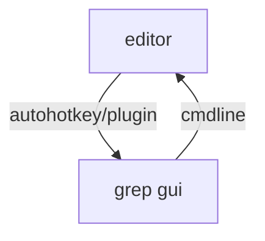

* AstroGrep #win
  https://sourceforge.net/projects/astrogrep/
  
RIght click to open file with editor of your choice at specific line (if setup)

* PowerGREP
price, win

* dnGrep
win
  https://dngrep.github.io/
  
Open line results in a custom editor, like Notepad++
  https://github.com/dnGrep/dnGrep/issues/237
  https://npp-user-manual.org/docs/command-prompt/

* grepWin
win
https://github.com/stefankueng/grepWin

ref
https://www.slant.co/topics/5541/~gui-grep-implementations-for-windows

---

ideal:

cmdline parameters possible?
  https://github.com/dnGrep/dnGrep/issues/442
