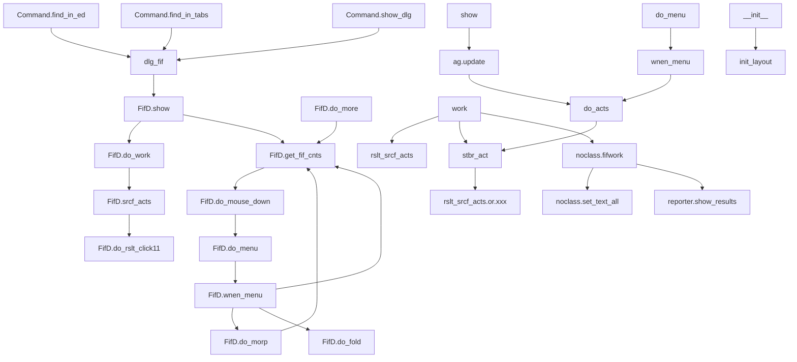

```mermaid
graph TD;
Command.find_in_ed --> dlg_fif
Command.find_in_tabs --> dlg_fif
Command.show_dlg --> dlg_fif
dlg_fif --> FifD.show
FifD.show --> FifD.do_work --> FifD.srcf_acts
FifD.show --> FifD.get_fif_cnts
FifD.do_morp --> FifD.get_fif_cnts
FifD.do_more --> FifD.get_fif_cnts
FifD.wnen_menu --> FifD.do_morp
FifD.wnen_menu --> FifD.get_fif_cnts
FifD.get_fif_cnts --> FifD.do_mouse_down --> FifD.do_menu --> FifD.wnen_menu --> FifD.do_fold
FifD.srcf_acts --> FifD.do_rslt_click11


work --> rslt_srcf_acts
work --> stbr_act
work --> noclass.fifwork --> noclass.set_text_all
noclass.fifwork --> reporter.show_results
show --> ag.update --> do_acts --> stbr_act --> rslt_srcf_acts.or.xxx
do_menu --> wnen_menu --> do_acts
__init__ --> init_layout
```